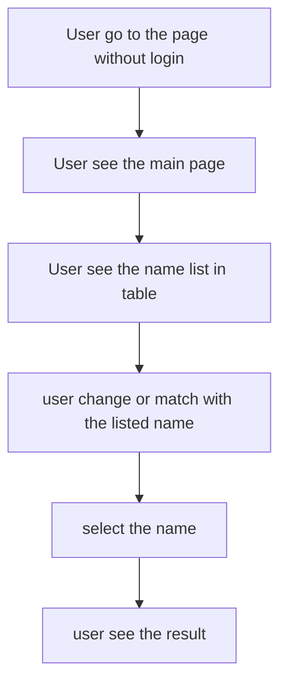

# Main Flow

1. User go to the page without login
2. User see the main page
3. User see the name list in table
4. user change or match with the listed name
5. select the name
6. user see the result

